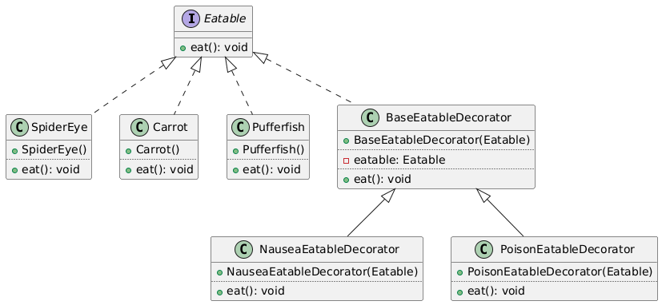

# Decorator Pattern - Java Implementation

## What is the Decorator Pattern?

The decorator pattern is a **structural design pattern** that allows behavior to be added to individual instances of a class without affecting other instances.

A decorator wraps an object to provide new functionality whitout altering its original functionality. These decorators can be stacked on top of each other and can be modified at runtime.

A good analogy is adding toppings to a pizza. You start with a basic pizza (the original object) and then add various toppings (decorators) to enhance its flavor without changing the base pizza itself.

## When to Use It?

Use the Decorator pattern when:
- You want to add responsibilities to individual objects dynamically and transparently, without affecting other objects
- You want to avoid subclassing for extending functionality, which can lead to an explosion of subclasses
- You want to add functionality to objects at runtime rather than compile time
- You want to stick to the Single Responsibility Principle by dividing functionality into classes with specific purposes

## How Does It Work?

The pattern consists of four main components:
1. **Base Interface** (`Eatable`): Defines the common interface for both the core object and decorators
2. **Concrete Components** (`Carrot`, `Spider Eye`, `Pufferfish`): Concrete implementations of the base interface
3. **Base Decorator** (`BaseEatableDecorator`): Implements the base interface and contains a reference to another implementation of the base interface
4. **Concrete Decorators** (`NauseaEatableDecorator`, `PoisonEatableDecorator`): Extend the base decorator to add specific functionalities

